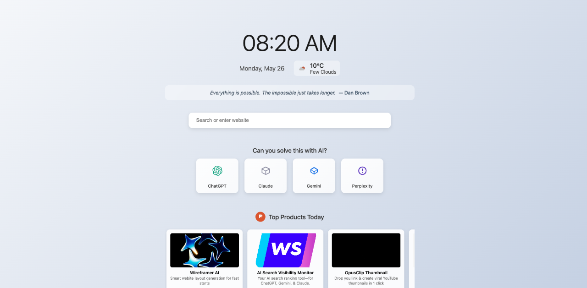

# AI Nudge 🌟

**AI Nudge** transforms your new tab page into an intelligent productivity hub—nudging you to leverage the power of AI at just the right moment.

## ✨ Features

- 🕒 **Clean New Tab UI** – Displays time, local weather, and an elegant interface.
- 🧠 **AI-Generated Inspiration** – Motivational quotes powered by OpenAI, refreshed every 30 minutes.
- 🚀 **Quick Access to AI Tools** – One-click shortcuts to ChatGPT, Claude, Gemini, and more.
- 🔥 **Product Hunt Discoveries** – Stay up-to-date with trending new tools and startups.
- ⚙️ **Customizable Nudging** – Choose when and how often the AI prompt appears.
- 🔒 **Privacy-First Design** – No data leaves your browser.

## 📦 Installation

1. Clone or download this repo.
2. Go to `chrome://extensions/` in your Chrome browser.
3. Enable **Developer mode** (top-right toggle).
4. Click **"Load unpacked"** and select the `ai-nudge-extension` directory.

## 🛠 API Configuration

To fully enable all features, configure the following API keys via the extension settings:

| Service       | Purpose                    | Get API Key From                          |
|---------------|-----------------------------|-------------------------------------------|
| OpenAI        | AI-generated quotes         | [https://platform.openai.com/account/api-keys](https://platform.openai.com/account/api-keys) |
| OpenWeather   | Local weather display       | [https://openweathermap.org/api](https://openweathermap.org/api) |
| Product Hunt  | Trending product feed       | [https://api.producthunt.com](https://api.producthunt.com) |

> 🔐 All API keys are stored locally in your browser and **never sent to external servers**.

## 🔧 Permissions

| Permission        | Why It’s Needed                                                  |
|-------------------|------------------------------------------------------------------|
| `storage`         | Save user preferences and API keys locally                      |
| `geolocation`     | Get accurate local weather data (only with your consent)         |
| `notifications`   | Show friendly, non-intrusive nudges when you open new tabs       |
| Host permissions  | Required for fetching data from OpenAI, OpenWeather, and Product Hunt APIs |

## 🧠 Why AI Nudge?

We often forget how much AI can assist in daily workflows—whether it's rewriting an email, analyzing data, or generating creative ideas. AI Nudge prompts you right when you open a new tab, encouraging thoughtful use of AI tools.

## 🖼 Screenshots

| 1280x800 | 640x400 |
|----------|---------|
|  |  |
|  |  |

## 📫 Support

For help or feature requests, email [arush361@gmail.com](mailto:arush361@gmail.com)

## 📄 License

[MIT License](LICENSE)

---

> Made with 💡 by [Arush](mailto:arush361@gmail.com) | Ideas deserve better timing.
